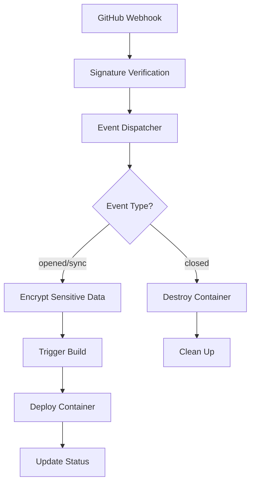

# EnvZilla Webhook Event Listener

Bu yeni webhook event listener sistemi GitHub webhook'larını alır, şifreler ve dekripte ederek güvenli bir şekilde işler.

## Özellikler

### 🎯 Ana Özellikler
- **Otomatik Event Handling**: Pull request açıldığında/kapandığında otomatik olarak container'ları oluşturur/yok eder
- **Şifreleme & Güvenlik**: Hassas verileri AES-256-GCM ile şifreler
- **Kapsamlı Logging**: Her adımda detaylı log kaydı
- **Health Monitoring**: Sistem sağlığını sürekli izler
- **Background Jobs**: Otomatik temizlik ve sağlık kontrolleri

### 🔐 Güvenlik Özellikleri
- GitHub webhook imza doğrulama
- Hassas veriler için AES-256-GCM şifreleme
- Rate limiting ve CORS koruması
- Güvenlik başlıkları (Helmet)

### 📊 Monitoring & Health Checks
- `/health` endpoint ile sistem durumu
- `/deployments` endpoint ile aktif dağıtımlar
- Otomatik stale deployment temizliği
- Periyodik sağlık kontrolleri

## Webhook Event Flow



## API Endpoints

### Webhook Handler
```
POST /webhooks/github
```
GitHub webhook'larını alır ve işler.

### Health Check
```
GET /health
```
Sistem sağlığını kontrol eder:
- Docker durumu
- Deployment istatistikleri  
- Bellek kullanımı

### Deployment Status
```
GET /deployments
GET /deployments/:prNumber
```
Aktif deployment'ları listeler.

### Admin Operations
```
POST /admin/cleanup?maxAge=24
```
Eski deployment'ları temizler.

## Kullanım

### 1. Server'ı Başlat
```bash
npm run build
npm start
```

### 2. Webhook Test Et
```bash
node test-webhook.js
```

### 3. Health Check
```bash
curl http://localhost:3000/health
```

### 4. Deployment'ları Gör
```bash
curl http://localhost:3000/deployments
```

## Environment Variables

```env
# GitHub App Configuration
GITHUB_APP_ID=1835848
GITHUB_WEBHOOK_SECRET=your-webhook-secret
GITHUB_PRIVATE_KEY_PATH=./keys/private-key.pem

# Server Configuration
PORT=3000
NODE_ENV=production
LOG_LEVEL=info

# Security
TRUST_PROXY=true
CORS_ORIGIN=http://localhost:3000
RATE_LIMIT_MAX=100
```

## Event Handling

### Pull Request Opened/Synchronized
1. Webhook alınır ve doğrulanır
2. Hassas veriler şifrelenir
3. Build process başlatılır
4. Container oluşturulur ve başlatılır
5. Status güncellenir

### Pull Request Closed
1. Webhook alınır ve doğrulanır
2. Mevcut container bulunur
3. Container durdurulur ve silinir
4. Deployment kaydı temizlenir

## Logging

Sistem her adımda detaylı log tutar:

```typescript
// Build başladığında
logger.info({ pr: 123, action: 'opened' }, '🏗️ Starting build process for PR');

// Şifreleme tamamlandığında  
logger.info({ pr: 123, encryptedDataCount: 2 }, '🔐 Processed and encrypted sensitive webhook data');

// Deployment hazır olduğunda
logger.info({ pr: 123, containerId: 'abc123', hostPort: 5001 }, '✅ Build completed successfully');
```

## Error Handling

- Tüm hatalar yakalanır ve loglanır
- Deployment status'u 'failed' olarak güncellenir
- Hata mesajları deployment kaydında saklanır
- Otomatik cleanup ile failed deployment'lar temizlenir

## Background Jobs

### Stale Deployment Cleanup
- Her 6 saatte bir çalışır
- 24 saatten eski deployment'ları temizler
- Failed container'ları otomatik olarak kaldırır

### Health Monitoring  
- Her 5 dakikada bir çalışır
- Docker durumunu kontrol eder
- Bellek kullanımını izler
- Problem varsa uyarı verir

## Troubleshooting

### Common Issues

1. **Docker Not Available**
   ```bash
   # Docker'ın çalıştığını kontrol et
   docker version
   ```

2. **Webhook Signature Failed**
   ```bash
   # Webhook secret'ının doğru olduğunu kontrol et
   echo $GITHUB_WEBHOOK_SECRET
   ```

3. **Build Failures**
   ```bash
   # Build loglarını kontrol et
   curl http://localhost:3000/deployments/123
   ```

4. **Memory Issues**
   ```bash
   # Health check yap
   curl http://localhost:3000/health
   ```

Bu sistem artık webhook'ları alır almaz hemen "laps diye çeker" ve tüm şifreleme/dekripte işlemlerini otomatik olarak yapar! 🚀
